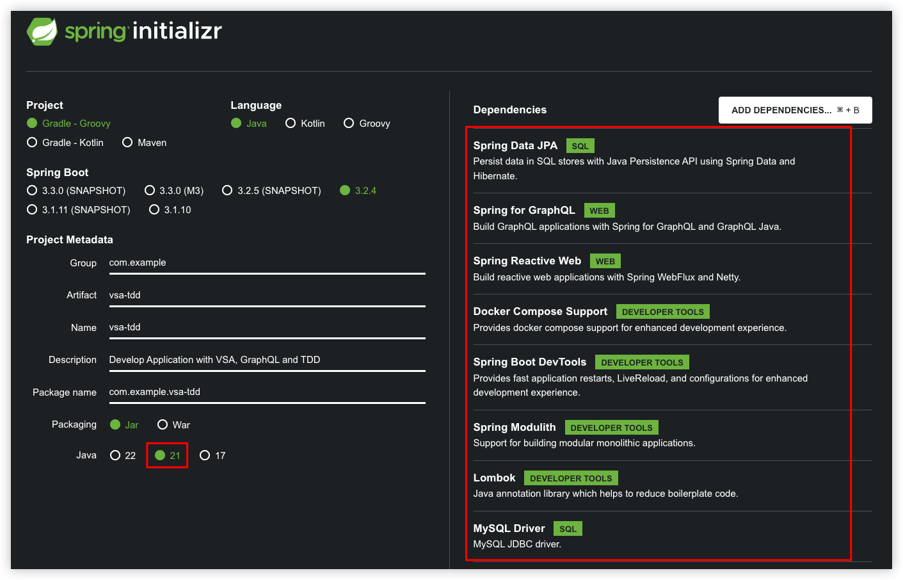
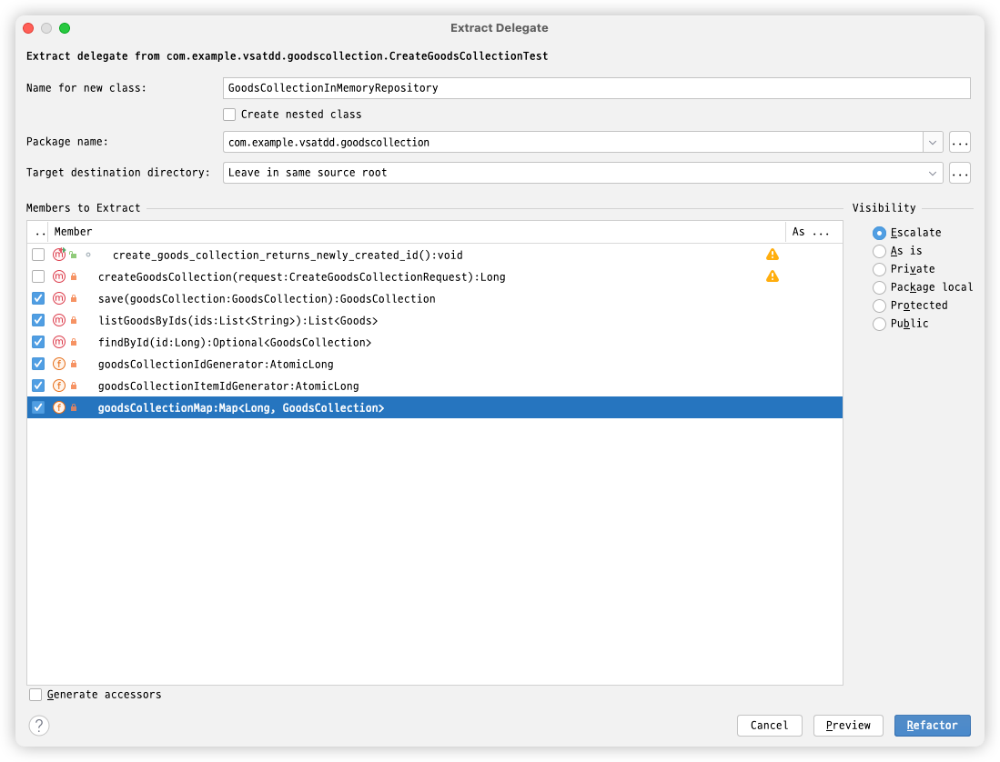
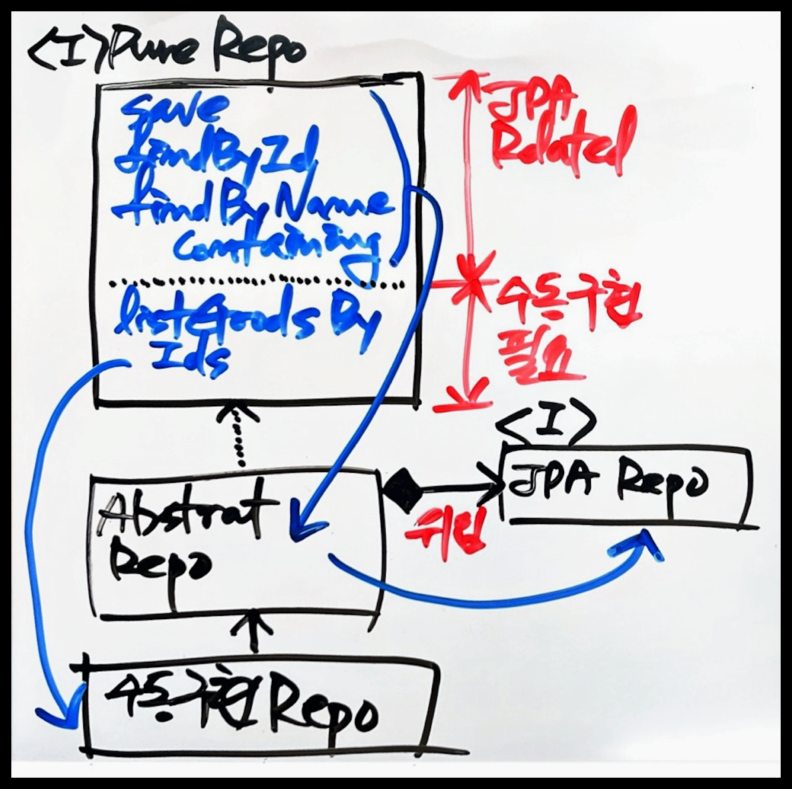
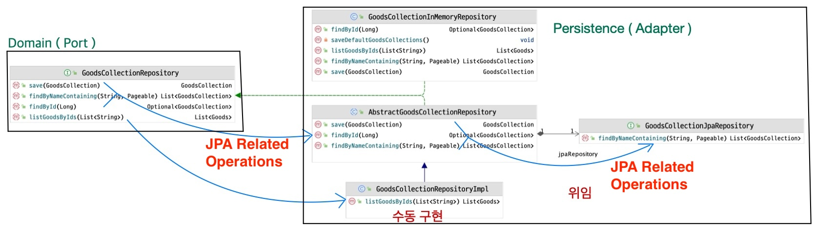
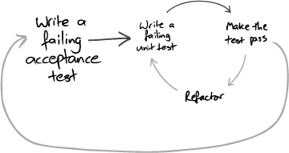

# Develop Application with VSA and TDD

- VSA(Vertical Slicing Architecture), GraphQL, Outside-in / Inside-out TDD를 사용한 Spring Boot Application 개발 예제
  - 계층이 아니라 기능별로 구현
  - 이 예제에 나오는 Goods는 전시 상품을 위한 객체. 실제는 엄청난 수의 속성을 갖음
  - 하지만 상품군(goodscollection) 도메인에서 1개의 속성(goodsNo)만 필요함. 추가적인 속성(goodsId, barcode)들은 시각적으로 도움을 받기 위해 추가한 중복 속성임
- mockito를 사용하지 않고 dummy, stub을 사용([Test Doubles](https://msbaek.github.io/codetemplate/tdd-terms.html#test-doubles))
- Test에 application service, repository, domain에 해당하는 로직을 모두 구현한 후 리팩터링(Extract Delegate, Move Instance Method 등)을 통해
  적합한 객체(Application Service, Repository, Domain object 등)로 로직을 이동하는 방향으로 진행
- List, HashMap, AtomicLong 등을 이용하는 InMemory Repository로 최대한 구현을 한 후 마지막에 JPA를 통해 영속 계층을 구현

<!-- TOC -->
* [Develop Application with VSA and TDD](#develop-application-with-vsa-and-tdd)
  * [create project](#create-project)
    * [start.io](#startio)
    * [docker compose 설정](#docker-compose-설정)
    * [의존성 추가](#의존성-추가)
    * [Enable Graphql & disable boot autoconfigure log](#enable-graphql--disable-boot-autoconfigure-log)
    * [Add runtime graphql wiring configurer](#add-runtime-graphql-wiring-configurer)
  * [구현 시작](#구현-시작)
  * [도메인 클래스 추가](#도메인-클래스-추가)
    * [기능 요구 사항](#기능-요구-사항)
    * [정적 설계](#정적-설계)
  * [행위 추가하기 - 상품군 생성하기](#행위-추가하기---상품군-생성하기)
    * [Acceptance Test(인수 테스트) - Outer TDD](#acceptance-test인수-테스트---outer-tdd)
      * [add failing acceptance test](#add-failing-acceptance-test)
      * [make it work with dummy](#make-it-work-with-dummy)
    * [CreateGoodsCollection 구현 - Inner TDD](#creategoodscollection-구현---inner-tdd)
      * [add failing test - CreateGoodsCollectionTest#create_goods_collection_returns_newly_created_id](#add-failing-test---creategoodscollectiontestcreate_goods_collection_returns_newly_created_id)
      * [make it work](#make-it-work)
      * [Extract Delegate in-memory repository](#extract-delegate-in-memory-repository)
      * [Extract Repository Interface](#extract-repository-interface)
      * [move instance method from test to model](#move-instance-method-from-test-to-model)
    * [make acceptance test work using DI](#make-acceptance-test-work-using-di)
      * [add approvaltests using findById](#add-approvaltests-using-findbyid)
  * [행위 추가하기 - 상품군 조회하기](#행위-추가하기---상품군-조회하기)
    * [Acceptance Test(인수 테스트) - Outer TDD](#acceptance-test인수-테스트---outer-tdd-1)
      * [Query 스키마 추가하기](#query-스키마-추가하기)
      * [add acceptance test](#add-acceptance-test)
      * [make it work with dummy](#make-it-work-with-dummy-1)
    * [Inner TDD](#inner-tdd)
  * [Implement Persistence Layer](#implement-persistence-layer)
  * [Packaging](#packaging)
  * [얻은 점들](#얻은-점들)
    * [전체적인 흐름(Inner and outer feedback loops in TDD)](#전체적인-흐름inner-and-outer-feedback-loops-in-tdd)
    * [순수한 Repository(GoodsCollectionRepository)를 사용하는 잇점](#순수한-repositorygoodscollectionrepository를-사용하는-잇점)
    * [ApprovalsTest](#approvalstest)
<!-- TOC -->

## create project

### [start.io](https://start.spring.io/)



- Spring Data JPA SQL
- Spring for GraphQL WEB
- Spring Reactive Web WEB
- Docker Compose Support DEVELOPER TOOLS
- Spring Boot DevTools DEVELOPER TOOLS
- Spring Modulith DEVELOPER TOOLS
- Lombok DEVELOPER TOOLS
- MySQL Driver SQL

### docker compose 설정

- application.yaml에 다음 라인 쿠착

```yaml
spring:
  docker:
    compose:
      lifecycle-management: start_only # docker compose를 이용해서 mysql을 실행
      skip:
        in-tests: false # test 시에도 docker compose를 실행
```

- build.gradle
  - spring-boot-docker-compose의 의존성 타입을 developmentOnly에서 implementation로 변경
    `implementation 'org.springframework.boot:spring-boot-docker-compose`

### 의존성 추가

```gradle
    repositories {
	maven { url 'https://jitpack.io' } // 추가 for ktown4u-utils
        mavenCentral()
    }

    implementation 'com.graphql-java:graphql-java-extended-scalars:21.0'
    testImplementation 'com.approvaltests:approvaltests:23.0.1'
    testImplementation 'com.github.HMInternational:ktown4u-utils:v1.5.0'
```

### Enable Graphql & disable boot autoconfigure log

```yaml
spring:
  jpa:
    hibernate:
      ddl-auto: update
  docker:
    compose:
      lifecycle-management: start_only # docker compose를 이용해서 mysql을 실행
      skip:
        in-tests: false # test 시에도 docker compose를 실행
  graphql:
    graphiql:
      enabled: true # graphiql 활성화
logging:
  level:
    org.springframework.boot.autoconfigure.logging: ERROR
```

### Add runtime graphql wiring configurer

```java

@Bean
public RuntimeWiringConfigurer runtimeWiringConfigurer() {
    return wiringBuilder -> wiringBuilder
            .scalar(ExtendedScalars.GraphQLBigDecimal)
            .scalar(ExtendedScalars.DateTime)
            .scalar(ExtendedScalars.Date);
}
```

## 구현 시작

- **무엇을 제일 먼저 해 구현하고 싶은가 ?**
  - 뭔가 동작하는것을 보면서 개발하고 싶다
  - GraphiQL 브라우저로 호출해 보고 싶다

```graphql
# src/main/resources/graphql/schema.graphqls
type Query {
    hello: String
}
```

## 도메인 클래스 추가

- 구현의 시작은 요구사항을 이해하고 개발 명세를 작성하는 것으로 시작
- 이 예제의 요구사항은 다음과 같다

### 기능 요구 사항

- 상품군 생성 요청(Mutation)
  - input: 상품군 이름과 goodsId 목록
  - process:
    - goodsId 목록을 이용해서 Goods 목록을 얻고, 이를 이용해서 GoodsCollectionItem 목록을 생성
    - GoodsCollection을 생성하고 GoodsCollectionItem 목록을 GoodsCollection에 추가
    - 저장
    - 신규로 생성된 GoodsCollection의 id를 반환
- 상품군 조회 요청(Query)
  - input: 상품군 이름, Paging, Sort 관련된 정보
  - output: 조건에 맞는 결과

### 정적 설계

- 최초 **정적 설계**를 통해 도메인 클래스를 추가(엔터티, 값 객체)
  - GoodsCollection, GoodsCollectionItem, Goods
  - 클래스, 속성, 관계에 집중

```java
public record Goods(Long goodsNo, String goodsId, String barcode) {
}
```

```java

@Getter
public class GoodsCollection {
    private Long id;
    private String name;
    private Long createdBy;
    private LocalDateTime createdAt;
    private Long updatedBy;
    private LocalDateTime updatedAt;
    private List<GoodsCollectionItem> goodsCollectionItems = new ArrayList<>();
```

```java

@Getter
public class GoodsCollectionItem {
    private Long id;
    private Long goodsNo;
    private String goodsId;
    private String barcode;
    private GoodsCollection goodsCollection;
```

## 행위 추가하기 - 상품군 생성하기

- Service, Repository, Domain Service 등을 구현하고 Controller를 연동하고 싶은가 ?
- 이런 경우 Controller 구현 시 예기치 않은 문제로 미리 구현한 클래스들에 대단위 수정을 가해야 하는 경우를 종종 겪었다
- 여기서는 `Controller + Application Service`를 하나의 클래스로 구현하는 것으로 시작한다.
  - 후에 로직이 복잡해지거나, 중복이 일어나면
  - Application Service → Domain Object(Entity, Value, Domain Service 등)로 추출한다.
- 그 보다 먼저 **인수 테스트**를 작성하여 언제 TDD가 멈춰야 할 지 알 수 있도록 한다.
- [Double-Loop TDD](https://sammancoaching.org/learning_hours/bdd/double_loop_tdd.html)

- 전체적인 흐름은 위 그림과 같다
  - 실패하는 인수 테스트를 작성한다
  - dummy, stub 등을 이용해서 인수테스트를 통과시킴
  - Inner TDD를 수행
    - failing test 추가
    - make it work
    - refactor
  - Inner TDD로 필요한 객체들의 구현을 완료하면 인수 테스트에서 이 객체들을 사용해서 성공하는지 확인
- Repository Interface를 정의하고, Map 이용한 InMemory Repository를 구현해서 모든 기능을 구현하고, 마지막으로 JPA 매핑 등을 통해 영속 계층을 구현하는 흐름을 따른다.

### Acceptance Test(인수 테스트) - Outer TDD

#### add failing acceptance test

- 언제 요구되는 기능이 완료되었는지 알 수 있게 해 주는 인수 테스트 작성
  - 상품군 조회 기능이 더 쉽지만 많은 것을 필요로 함
  - 상품군 생성은 더 어려우나 필요한 것이 적음
- failing test 작성 - GoodsCollectionAcceptanceTest#create_goods_collection

```java

@AutoConfigureHttpGraphQlTester
@ApplicationModuleTest(webEnvironment = SpringBootTest.WebEnvironment.MOCK)
public class GoodsCollectionAcceptanceTest {
    @Autowired private HttpGraphQlTester graphQlTester;

    @Test
    public void create_goods_collection() throws Exception {
        String queryString = """
                mutation {
                    createGoodsCollection(request: {
                        name: "Collection 1"
                        ids: ["GD00112296", "GD00112297", "9000000112298", "9000000112299"]
                    })
                }
                """;

        Long result = request(queryString, "createGoodsCollection")
                .entity(Long.class)
                .get();
        assertThat(result).isGreaterThan(0L);
    }

    private GraphQlTester.Path request(String queryString, String requestName) {
        return this.graphQlTester
                .mutate()
                .build()
                .document(queryString)
                .execute()
                .path(requestName);
    }
}
```

#### make it work with dummy

- Mutation 스키마 추가하기

```graphql
type Query {
    sayHello(name: String): String!
}

type Mutation {
    createGoodsCollection(request: CreateGoodsCollectionRequest): ID!
}

input CreateGoodsCollectionRequest {
    name: String!
    ids: [String!]!
}
```

- CreateGoodsCollection Use Case

```java
@Slf4j
@RequiredArgsConstructor
@Transactional
@Controller
public class CreateGoodsCollection {
    @MutationMapping("createGoodsCollection")
    public Long createGoodsCollection(@Argument final CreateGoodsCollectionRequest request) {
        return 1L;
    }

    record CreateGoodsCollectionRequest(String name, List<String> ids) {
    }
}
```

- mockito를 이용할 수도 있지만 dummy([Test Doubles](https://msbaek.github.io/codetemplate/tdd-terms.html#test-doubles))를 이용한 편이
  훨씬 더 편하고, 빠른 것 같다.
  - 심지어 최근엔 copilot 등으로 인해 자동 완성이 엄청나다.
  - Dto, Domain 모델의 속성 등을 알려주고 json, sql 등을 만들어 달라고 하면 그런 데이터도 쉽게 만들어 준다

### CreateGoodsCollection 구현 - Inner TDD

#### add failing test - CreateGoodsCollectionTest#create_goods_collection_returns_newly_created_id

```java
class CreateGoodsCollectionTest {
    @Test
    void create_goods_collection_returns_newly_created_id() {
        Long newlyCreatedId = createGoodsCollection(
                new CreateGoodsCollection.CreateGoodsCollectionRequest(
                        "Collection 1",
                        List.of("GD00112296", "GD00112297", "9000000112298", "9000000112299")));
        assertThat(newlyCreatedId).isGreaterThan(0L);
        Approvals.verify(
                Neutralizer.localDateTime(
                        YamlPrinter.printWithExclusions(
                                findById(newlyCreatedId).get(), "id")
                )
        );
    }

    private Optional<GoodsCollection> findById(Long id) {
        throw new UnsupportedOperationException("CreateGoodsCollectionTest::findById not implemented yet");
    }

    private Long createGoodsCollection(CreateGoodsCollection.CreateGoodsCollectionRequest createGoodsCollectionRequest) {
        throw new UnsupportedOperationException("CreateGoodsCollectionTest::createGoodsCollection not implemented yet");
    }
}
```

- **별도의 협력객체(collaborator)를 사용하지 않고 최대한 테스트 클래스에서 필요한 모든 기능(findById, createGoodsCollection 등)을 구현**한다.
- 이후 테스트가 성공하면 적절한 객체로 기능을 이동시킨다

#### make it work

- 테스트 클래스에 모든 구현을 제공하여 성공시키기
- 테스트 클래스에 Application Service, Repository, Domain Object 등에 구현할 모든 기능을 직관적으로 구현
  - **리팩터링은 최대한 나중에. 하지만 꼭**

```java
class CreateGoodsCollectionTest {
    /**
     * 실제 DB에서 조회한 상품 정보를 담고 있는 Map
     * 순서도 유지함
     */
    private final Map<Long, Goods> goodsMap = List.of(
                    new Goods(112296L, "GD00112296", "9000000112296"),
                    new Goods(112297L, "GD00112297", "9000000112297"),
                    new Goods(112298L, "GD00112298", "9000000112298"),
                    new Goods(112299L, "GD00112299", "9000000112299"),
                    new Goods(112300L, "GD00112300", "9000000112300"),
                    new Goods(112301L, "GD00112301", "9000000112300"),
                    new Goods(112303L, "GD00112303", "9000000112303"),
                    new Goods(112304L, "GD00112304", "9000000112304"),
                    new Goods(112306L, "GD00112306", "9000000112306"),
                    new Goods(112307L, "GD00112307", "9000000112307"))
            .stream()
            .collect(toMap(Goods::goodsNo, Function.identity()));
    private final AtomicLong goodsCollectionId = new AtomicLong(1L);
    private Map<Long, GoodsCollection> goodsCollectionMap = new HashMap<>();

    @Test
    void create_goods_collection_returns_newly_created_id() {
        Long newlyCreatedId = createGoodsCollection(
                new CreateGoodsCollection.CreateGoodsCollectionRequest(
                        "Collection 1",
                        List.of("GD00112296", "GD00112297", "9000000112298", "9000000112299")));
        assertThat(newlyCreatedId).isGreaterThan(0L);
        Approvals.verify(
                Neutralizer.localDateTime( // LcoalDateTime 형식 문자열을 지정된 문자열로 치환하여 시간 변경을 무력화
                        YamlPrinter.printWithExclusions( // YAML 형식으로 데이터를 출력하는데 "id" 필드는 제외함
                                findById(newlyCreatedId).get(), "id")
                )
        );
    }

    private Optional<GoodsCollection> findById(Long id) {
        return Optional.ofNullable(goodsCollectionMap.get(id));
    }

    private Long createGoodsCollection(CreateGoodsCollection.CreateGoodsCollectionRequest request) {
        GoodsCollection goodsCollection = new GoodsCollection(request.name(), userId());
        List<Goods> goodsList = findGoodsByIds(request.ids());
        for (Goods goods : goodsList) {
            goodsCollection.addItem(new GoodsCollectionItem(goods));
        }
        save(goodsCollection);
        return goodsCollection.getId();
    }

    private void save(GoodsCollection goodsCollection) {
        goodsCollection.setId(goodsCollectionId.getAndIncrement());
        goodsCollectionMap.put(goodsCollection.getId(), goodsCollection);
    }

    private List<Goods> findGoodsByIds(List<String> ids) {
        return goodsMap.values().stream()
                .filter(goods -> ids.contains(goods.goodsId()) || ids.contains(goods.barcode()))
                .sorted(Comparator.comparing(Goods::goodsId)) // DB 쿼리와 정렬 순서를 맞추기 위해
                .toList();
    }

    private Long userId() {
        return 1L;
    }
}
```

#### Extract Delegate in-memory repository

- slide methods
- extract delegate repository

  - 

#### Extract Repository Interface

- 

- **테스트 작성 시점에 Repository Interface를 먼저 정하는 것이 좋을수도**
  - in memory repository의 인터페이스가 부적합해 질 수 있음
    - JPA 등을 사용하기게 부적합할 수도
  - 테스트를 작성하는 시점에 협력 객체들과 인터페이스를 점진적으로 발견하는 것도 중요

#### move instance method from test to model

- move createGoodsCollection method from test to model
- move GoodsCollectionInMemoryRepository from test to model

### make acceptance test work using DI

```java

@Profile("in-memory")
@Repository
public class GoodsCollectionInMemoryRepository implements GoodsCollectionRepository
```

#### add approvaltests using findById

```java
    Approvals.verify(
        Neutralizer.localDateTime(
        YamlPrinter.printWithExclusions(repository.findById(result).get(), "id")));
```

## 행위 추가하기 - 상품군 조회하기

### Acceptance Test(인수 테스트) - Outer TDD

#### Query 스키마 추가하기

```graphql
type Query {
    listGoodsCollection( request: SearchDto = { sort: { by: createdAt, direction: desc } } ): GoodsCollectionSlice
}

type GoodsCollectionSlice {
    totalElements: Int
    content: [GoodsCollectionDto]
}

type GoodsCollectionDto {
    id: ID!
    name: String!
    createdBy: Int!
    createdAt: String!
    updatedBy: Int
    updatedAt: String
    goodsCollectionItems: [GoodsCollectionItemDto]
}

type GoodsCollectionItemDto {
    goodsNo: Int!
    goodsId: String!
    barcode: String
}

input SearchDto {
    keyword: String = ""
    type: String = "name"
    page: Int = 0
    size: Int = 20
    sort: Sort = { by: createdAt, direction: desc }
}

input Sort {
    by: SortBy = createdAt
    direction: SortDirection = desc
}

enum SortBy {
    createdAt
    barcode
    id
    name
}

enum SortDirection {
    asc
    desc
}

scalar BigDecimal
scalar Date
scalar DateTime
```

#### add acceptance test

```java

@Test
public void listGoodsCollection() throws Exception {
    String queryString = """
             query {
               listGoodsCollection(request: {
                 keyword: "Collection 0",
                 type: "type",
                 page: 0,
                 size: 10
               }) {
                 content {
                   name
                   createdBy
                   createdAt
                   goodsCollectionItems {
                     goodsNo
                     goodsId
                     barcode
                   }
                 }
               }
            }
             """;

    List<GetGoodsCollection.GoodsCollectionDto> result = request(queryString, "listGoodsCollection.content")
            .entityList(GetGoodsCollection.GoodsCollectionDto.class)
            .get();
    Approvals.verify(Neutralizer.localDateTime(YamlPrinter.printWithExclusions(result, "updatedBy", "updatedAt")));
}
```

#### make it work with dummy

```java
public class GetGoodsCollection {
    private final GoodsCollectionRepository repository;

    @QueryMapping("listGoodsCollection")
    public Page<GoodsCollectionDto> listGoodsCollection(@Argument final SearchDto request) {
        return new PageImpl<>(Collections.emptyList(), PageRequest.of(request.page(), request.size()), 0);
    }

    record GoodsCollectionDto(String name, Long createdBy, LocalDateTime createdAt, Long updatedBy,
                              LocalDateTime updatedAt, List<GoodsCollectionItemDto> goodsCollectionItems) {
    }

    record GoodsCollectionItemDto(Long goodsNo, String goodsId, String barcode) {
    }
}
```

- SeachDto

```java
public record SearchDto(String type, String keyword, Integer page, Integer size, SortDto sort) {
    public String sortBy() {
        return sort().by();
    }

    public String sortDirection() {
        return sort().direction();
    }

    public Pageable pageable() {
        return PageRequest.of(page(), size());
    }

    public int offset() {
        return page * size;
    }

    public boolean isAscending() {
        return "asc".equals(sortDirection());
    }

    public Pageable pageableWithSort() {
        Sort sort = isAscending() ?
                Sort.by(Sort.Order.asc(sortBy()))
                : Sort.by(Sort.Order.desc(sortBy()));
        return PageRequest.of(page(), size(), sort);
    }
}

record SortDto(String by, String direction) {
}
```

### Inner TDD

- 이번에는 바로 Application Service에서 구현해 보자

```java
public class GetGoodsCollection {
    private final GoodsCollectionRepository repository;

    @QueryMapping("listGoodsCollection")
    public Page<GoodsCollectionDto> listGoodsCollection(@Argument final SearchDto request) {
        List<GoodsCollection> goodsCollections = repository.findByNamingContaining(request.keyword(), request.pageableWithSort());
        List<GoodsCollectionDto> result = goodsCollections.stream()
                .map(GoodsCollectionDto::from)
                .toList();
        return new PageImpl<>(result, PageRequest.of(request.page(), request.size()), result.size());
    }

    record GoodsCollectionDto(Long id, String name, Long createdBy, LocalDateTime createdAt, Long updatedBy,
                              LocalDateTime updatedAt, List<GoodsCollectionItemDto> goodsCollectionItems) {
        public static GoodsCollectionDto from(GoodsCollection goodsCollection) {
            List<GoodsCollectionItemDto> itemDtoList = goodsCollection.getGoodsCollectionItems().stream()
                    .map(GoodsCollectionItemDto::from)
                    .toList();
            return new GoodsCollectionDto(goodsCollection.getId(), goodsCollection.getName(), goodsCollection.getCreatedBy(), goodsCollection.getCreatedAt(), goodsCollection.getUpdatedBy(), goodsCollection.getUpdatedAt(), itemDtoList);
        }
    }

    record GoodsCollectionItemDto(Long goodsNo, String goodsId, String barcode) {
        public static GoodsCollectionItemDto from(GoodsCollectionItem goodsCollectionItem) {
            return new GoodsCollectionItemDto(goodsCollectionItem.getGoodsNo(), goodsCollectionItem.getGoodsId(), goodsCollectionItem.getBarcode());
        }
    }
}
```

- listGoodsCollection을 위한 최기 데이터 생성 로직(InMemory Repository) 추가

```java
    public GoodsCollectionInMemoryRepository() {
        createGoodsCollectionForList();
    }

    private void createGoodsCollectionForList() {
        GoodsCollection goodsCollection = new GoodsCollection("Collection 0", 1L);
        goodsCollection.setId(goodsCollectionId.getAndIncrement());
        goodsCollection.addItem(new GoodsCollectionItem(goodsMap.get(112296L)));
        goodsCollection.addItem(new GoodsCollectionItem(goodsMap.get(112297L)));
        goodsCollection.addItem(new GoodsCollectionItem(goodsMap.get(112298L)));
        goodsCollection.addItem(new GoodsCollectionItem(goodsMap.get(112299L)));
        goodsCollectionMap.put(goodsCollection.getId(), goodsCollection);
    }

    @Override
    public List<GoodsCollection> findByNamingContaining(String keyword, Pageable pageable) {
        return goodsCollectionMap.values().stream()
                .filter(goodsCollection -> goodsCollection.getName().contains(keyword))
                .toList();
    }
```

## Implement Persistence Layer

- Repository 클래스 다이어그램
  - 개념 모델
    
  - 구현 모델
    
    - 순수한 GoodsCollectionRepository에 원하는 기능을 정의
    - InMemory 구현은 Map등을 이용
    - JPA 매핑을 해야 하는 시점에는
      - JpaRepository 추가
        - JpaRepository는 인터페이스 형식이지만
        - spring에서 내부적으로 proxy를 생성해서 구현체를 제공
      - Abstract 구현 추가
        - JPA를 이용한는 기능은 모두 JpaRepository에 위임
      - Repository 구현
        - Abstract Repository를 상속
        - Abstract에서 구현하지 않은 메서드만 구현
- jpa mapping
  - GoodsCollection
    ```java
    @NoArgsConstructor
    @Getter
    @Entity
    public class GoodsCollection {
        @Id
        @GeneratedValue(strategy = GenerationType.IDENTITY)
        private Long id;
        private String name;
        private Long createdBy;
        private LocalDateTime createdAt;
        private Long updatedBy;
        private LocalDateTime updatedAt;
        @OneToMany(mappedBy = "goodsCollection", cascade = CascadeType.ALL, orphanRemoval = true)
        private List<GoodsCollectionItem> goodsCollectionItems = new ArrayList<>();
        // ...
    ```
    - GoodsCollectionItem
    ```java
    @Getter
    @NoArgsConstructor
    @Entity
    public class GoodsCollectionItem {
        @Id
        @GeneratedValue(strategy = GenerationType.IDENTITY)
        private Long id;
        private Long goodsNo;
        private String goodsId;
        private String barcode;
        @JsonIgnore
        @ManyToOne
        @JoinColumn(name = "GOODS_COLLECTION_ID", nullable = false)
        private GoodsCollection goodsCollection;
        // ...
    ```
- add repository classes
  - AbstractGoodsCollectionRepository
    ```java
    @RequiredArgsConstructor
    public abstract class AbstractGoodsCollectionRepository implements GoodsCollectionRepository {
        private final GoodsCollectionJpaRepository jpaRepository;

        @Override
        public Optional<GoodsCollection> findById(Long id) {
            return jpaRepository.findById(id);
        }

        @Override
        public GoodsCollection save(GoodsCollection goodsCollection) {
            return jpaRepository.save(goodsCollection);
        }

        @Override
        public List<GoodsCollection> findByNamingContaining(String keyword, Pageable pageable) {
            return jpaRepository.findByNameContaining(keyword, pageable);
        }
    }
    ```
    - GoodsCollectionJpaRepository
    ```java
    public interface GoodsCollectionJpaRepository extends JpaRepository<GoodsCollection, Long> {
        List<GoodsCollection> findByNameContaining(String keyword, Pageable pageable);
    }
    ```
    - GoodsCollectionRepositoryImpl
    ```java
    @Profile("prod")
    @Repository
    public class GoodsCollectionRepositoryImpl extends AbstractGoodsCollectionRepository {
    @PersistenceContext
    private EntityManager em;

        public GoodsCollectionRepositoryImpl(GoodsCollectionJpaRepository jpaRepository) {
            super(jpaRepository);
        }

        @Override
        public List<Goods> findGoodsByIds(List<String> ids) {
            List<Object[]> resultList = em.createNativeQuery("""
                            select g.goods_no goodsno, g.goods_id as goodsid, g.barcode as barcode
                             from goods g
                              where (g.goods_id in :ids)
                              or (g.barcode in :ids)
                              order by g.goods_no
                """).setParameter("ids", ids).getResultList();
            return resultList.stream()
                    .map(result -> Goods.of((Object[]) result))
                    .toList();
        }
    }
    ```
- seed data
  - GOODS.sql
    ```sql
    create table if not exists goods
    (
        goods_no bigint comment '상품no' primary key,
        goods_id varchar(20)              null comment '상품id',
        barcode  varchar(100)             null comment '바코드'
    );
    delete from goods_collection_item where 1 = 1;
    delete from goods_collection where 1 = 1;
    delete from goods where 1 = 1;
    insert into goods (goods_no, goods_id, barcode) values (112296, 'GD00112296', '9000000112296') on duplicate key update goods_id=values(goods_id), barcode=values(barcode);
    insert into goods (goods_no, goods_id, barcode) values (112297, 'GD00112297', '9000000112297') on duplicate key update goods_id=values(goods_id), barcode=values(barcode);
    insert into goods (goods_no, goods_id, barcode) values (112298, 'GD00112298', '9000000112298') on duplicate key update goods_id=values(goods_id), barcode=values(barcode);
    insert into goods (goods_no, goods_id, barcode) values (112299, 'GD00112299', '9000000112299') on duplicate key update goods_id=values(goods_id), barcode=values(barcode);
    insert into goods (goods_no, goods_id, barcode) values (112300, 'GD00112300', '9000000112300') on duplicate key update goods_id=values(goods_id), barcode=values(barcode);
    insert into goods (goods_no, goods_id, barcode) values (112301, 'GD00112301', '9000000112300') on duplicate key update goods_id=values(goods_id), barcode=values(barcode);
    insert into goods (goods_no, goods_id, barcode) values (112303, 'GD00112303', '9000000112303') on duplicate key update goods_id=values(goods_id), barcode=values(barcode);
    insert into goods (goods_no, goods_id, barcode) values (112304, 'GD00112304', '9000000112304') on duplicate key update goods_id=values(goods_id), barcode=values(barcode);
    insert into goods (goods_no, goods_id, barcode) values (112306, 'GD00112306', '9000000112306') on duplicate key update goods_id=values(goods_id), barcode=values(barcode);
    insert into goods (goods_no, goods_id, barcode) values (112307, 'GD00112307', '9000000112307') on duplicate key update goods_id=values(goods_id), barcode=values(barcode);
    ```
  - GOODS_COLLECTION.sql
    ```sql
    delete from goods_collection_item where 1 = 1;
    delete from goods_collection where 1 = 1;
    INSERT INTO goods_collection (created_at, created_by, id, updated_at, updated_by, name) VALUES ('2024-04-07 21:40:58.095256', 1, 1, null, null, 'Collection 0');
    INSERT INTO goods_collection_item (goods_collection_id, goods_no, id, barcode, goods_id) VALUES (1, 112296, 1, '9000000112296', 'GD00112296');
    INSERT INTO goods_collection_item (goods_collection_id, goods_no, id, barcode, goods_id) VALUES (1, 112297, 2, '9000000112297', 'GD00112297');
    INSERT INTO goods_collection_item (goods_collection_id, goods_no, id, barcode, goods_id) VALUES (1, 112298, 3, '9000000112298', 'GD00112298');
    INSERT INTO goods_collection_item (goods_collection_id, goods_no, id, barcode, goods_id) VALUES (1, 112299, 4, '9000000112299', 'GD00112299');
    ```
  - seed data는 in memory에서 사용하는 데이터와 동일하게

## Packaging

- persistence, domain으로 나누어 패키징

## 얻은 점들

### 전체적인 흐름(Inner and outer feedback loops in TDD)


- from [Growing Object-Oriented Software, Guided by Tests: Freeman, Steve, Pryce, Nat: 9780321503626: Amazon.com: Books](https://www.amazon.com/Growing-Object-Oriented-Software-Guided-Tests/dp/0321503627)

- Outer TDD
  - 구현 완료를 확인할 수 있는 인수 테스트를 먼저 작성
  - 실제 DB와 GraphQl Controller, JPA 등을 사용
- Inner TDD
  - 하나의 인수 테스트를 통과하기 위해 필요한 기능을 구현
  - InMemory Repository를 사용
- 기능을 적절한 곳에 배치하는 순서
  - 최초엔 Test 클래스에 **설계를 고려하지 않고 빠르게 절차적으로 구현해서 동작하도록 만들기**
    - 기능 구현을 완료해 봐야만 **문제를 정확히 이해** 가능
    - 구현 중에 **발생 가능한 이슈**를 사전에 예측하기 어려움
  - **Test 클래스 → InMemory Repository, Application Service → Application Service -> domain**
    - **SoC**
    - **split by levels of abstraction**
    - **split unrelated complexity**(by fixture conflict)
  - Test에서 Domain Service로 추출할 로직, Application Serivce로 추출할 로직을 미리 분리하지 말아야
    - Applicaton Service로 추출 후 Domain Service로 추출하는 것이 더 쉬움
  - [빵구조](https://msbaek.github.io/codetemplate/terms.html#functional-core-imperative-shell) 지향
  - 최초 테스트에 모든 구현을 해서 빠르고 집중해서 진행 가능
- 기능 구현을 모두 마친 후에 JPA Mapping
  - InMemory Repository를 JPA Repository로 변경
  - 이 부분에서 **매우 부드럽게 완료**되었음
  - 위 Repository 클래스 다이어그램 참조

### 순수한 Repository(GoodsCollectionRepository)를 사용하는 잇점

- JPA 매핑을 초기에 하면
  - JPA Repository, DB에 의존하게 됨
  - 느림
  - Stubbing이 어려움. 많은 메소드를 Stubbing해야 함
  - Duct Tape Programming에 부적합
  - Entity 마다 JPA Repository를 생성하는 경향 발생
    - Aggregate에 동작하는 Repository를 보기 어려움
  - JPA Repository에 manual한 구현이 필요한 경우 대응이 어려움
    - ex. GOODS처럼 JPA 매핑이 어려운 레거시 테이블을 다뤄야 할 때
  - 구현 초기에 JPA 매핑을 하면 너무 일찍 구현에 의존하게 됨
- 대개의 경우 리팩터링을 일찍하는 경우가 많은데 JPA를 적용하면 롤백도 어렵고, 더 느려짐

### In Memory Repository를 이용해서 개발 후 부드럽게 영속 계층 구현하기
- 모든 기능을 InMemory Repository로 구현하고, 이후 JPA Repository로 변경했는데 In Memory Repository를 사용해서 테스트를 성공시킬 때 사용한 검증데이터(xxx approved.txt)를 영속 계층을 구현한 후에도 변경 없이 사용할 수 있어서 부드럽게 진행이 되었음

### ApprovalsTest

- UI를 보고 확인하는 효과를 줌
  ```yaml
  ---
  name: "Collection 1"
  createdBy: 1
  createdAt: "2003-05-03T10:11:12.134567"
  goodsCollectionItems:
    - goodsNo: 112307
      goodsId: "GD00112307"
      barcode: "9000000112307"
    - goodsNo: 112306
      goodsId: "GD00112306"
      barcode: "9000000112306"
    - goodsNo: 112304
      goodsId: "GD00112304"
      barcode: "9000000112304"
    - goodsNo: 112303
      goodsId: "GD00112303"
      barcode: "9000000112303"
  ```
- 회사에서 사용 중인 YamlPrinter, Neutralizer 등을 이용해서 포커싱해야 하는 정보만 확인
- 꼭 필요한 정보만 보여줘서 가독성을 높게

## 참고자료
- [Vertical Slice Architecture - Jimmy Bogard](https://www.jimmybogard.com/vertical-slice-architecture/)
- [Vertical Slicing Architectures - Victor Rentea](https://www.youtube.com/watch?v=H7HWOlANX78&list=WL&index=27&t=34s)