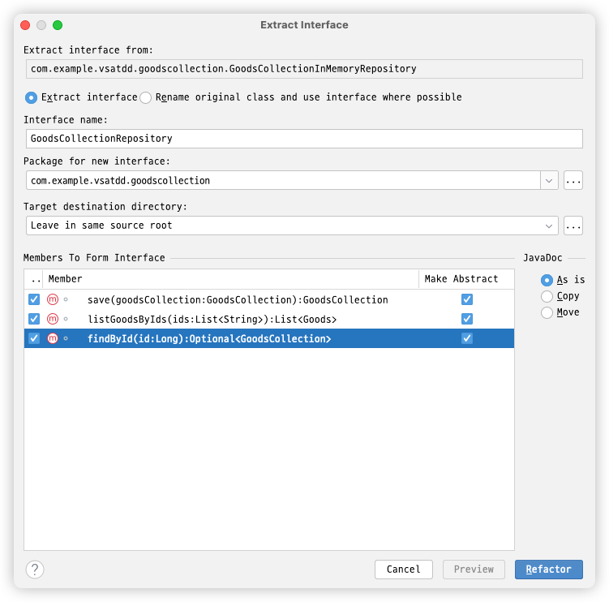

# Develop Application with VSA and TDD

- VSA(Vertical Slicing Architecture), GraphQL, Outside-in / Inside-out TDD를 사용한 Spring Boot Application 개발 예제
  - 계층이 아니라 기능별로 구현
  - 이 예제에 나오는 Goods는 전시 상품을 위한 객체. 실제는 엄청난 수의 속성을 갖음
  - 하지만 상품군(goodscollection) 도메인에서 1개의 속성(goodsNo)만 필요함. 추가적인 속성(goodsId, barcode)들은 시각적으로 도움을 받기 위해 추가한 중복 속성임
- mockito를 사용하지 않고 dummy, stub을 사용([Test Doubles](https://msbaek.github.io/codetemplate/tdd-terms.html#test-doubles))
- Test에 application service, repository, domain에 해당하는 로직을 모두 구현한 후 리팩터링(Extract Delegate, Move Instance Method 등)을 통해
  적합한 객체(Application Service, Repository, Domain object 등)로 로직을 이동하는 방향으로 진행
- List, HashMap, AtomicLong 등을 이용하는 InMemory Repository로 최대한 구현을 한 후 마지막에 JPA를 통해 영속 계층을 구현

<!-- TOC -->

- [Develop Application with VSA and TDD](#develop-application-with-vsa-and-tdd)
  - [create project](#create-project)
    - [start.io](#startio)
    - [docker compose 설정](#docker-compose-설정)
    - [의존성 추가](#의존성-추가)
    - [Enable Graphql](#enable-graphql)
    - [Add runtime graphql wiring configurer](#add-runtime-graphql-wiring-configurer)
  - [도메인 클래스 추가](#도메인-클래스-추가)
  - [구현 시작](#구현-시작)
  - [행위 추가하기 - 상품군 생성하기](#행위-추가하기---상품군-생성하기)
    - [Acceptance Test(인수 테스트) - Outer TDD](#acceptance-test인수-테스트---outer-tdd)
      - [Mutation 스키마 추가하기](#mutation-스키마-추가하기)
      - [add acceptance test](#add-acceptance-test)
      - [make it work with dummy](#make-it-work-with-dummy)
    - [CreateGoodsCollection 구현 - Inner TDD](#creategoodscollection-구현---inner-tdd)
      - [add failing test - CreateGoodsCollectionTest#create_goods_collection_returns_newly_created_id](#add-failing-test---creategoodscollectiontestcreate_goods_collection_returns_newly_created_id)
      - [make it work](#make-it-work)
      - [Extract Delegate in-memory repository](#extract-delegate-in-memory-repository)
      - [move instance method from test to model](#move-instance-method-from-test-to-model)
    - [make acceptance test work using DI](#make-acceptance-test-work-using-di)
      - [add approvaltests using findById](#add-approvaltests-using-findbyid)
  - [행위 추가하기 - 상품군 조회하기](#행위-추가하기---상품군-조회하기)
    - [Acceptance Test(인수 테스트) - Outer TDD](#acceptance-test인수-테스트---outer-tdd-1)
      - [Query 스키마 추가하기](#query-스키마-추가하기)
      - [add acceptance test](#add-acceptance-test-1)
      - [make it work with dummy](#make-it-work-with-dummy-1)
    - [Inner TDD](#inner-tdd)
  - [Implement Persistence Layer](#implement-persistence-layer)
  - [Packaging](#packaging)
  - [얻은 점들](#얻은-점들)
    - [전체적인 흐름(Inner and outer feedback loops in TDD)](#전체적인-흐름inner-and-outer-feedback-loops-in-tdd)
    - [순수한 Repository(GoodsCollectionRepository)를 사용하는 잇점](#순수한-repositorygoodscollectionrepository를-사용하는-잇점)
    - [ApprovalsTest](#approvalstest)

<!-- TOC -->

## create project

### [start.io](https://start.spring.io/)


- Spring Data JPA SQL
- Spring for GraphQL WEB
- Spring Reactive Web WEB
- Docker Compose Support DEVELOPER TOOLS
- Spring Boot DevTools DEVELOPER TOOLS
- Spring Modulith DEVELOPER TOOLS
- Lombok DEVELOPER TOOLS
- MySQL Driver SQL

### docker compose 설정

- application.yaml에 다음 라인 쿠착

```yaml
spring:
  docker:
    compose:
      lifecycle-management: start_only # docker compose를 이용해서 mysql을 실행
      skip:
        in-tests: false # test 시에도 docker compose를 실행
```

- build.gradle
  - spring-boot-docker-compose의 의존성 타입을 developmentOnly에서 implementation로 변경
    `implementation 'org.springframework.boot:spring-boot-docker-compose`

### 의존성 추가

```gradle
    repositories {
	maven { url 'https://jitpack.io' } // 추가 for ktown4u-utils
        mavenCentral()
    }

    implementation 'com.graphql-java:graphql-java-extended-scalars:21.0'
    testImplementation 'com.approvaltests:approvaltests:23.0.1'
    testImplementation 'com.github.HMInternational:ktown4u-utils:v1.5.0'
```

### Enable Graphql & disable boot autoconfigure log

```yaml
spring:
  jpa:
    hibernate:
      ddl-auto: update
  docker:
    compose:
      lifecycle-management: start_only # docker compose를 이용해서 mysql을 실행
      skip:
        in-tests: false # test 시에도 docker compose를 실행
  graphql:
    graphiql:
      enabled: true # graphiql 활성화
logging:
  level:
    org.springframework.boot.autoconfigure.logging: ERROR
```

### Add runtime graphql wiring configurer

```java

@Bean
public RuntimeWiringConfigurer runtimeWiringConfigurer() {
    return wiringBuilder -> wiringBuilder
            .scalar(ExtendedScalars.GraphQLBigDecimal)
            .scalar(ExtendedScalars.DateTime)
            .scalar(ExtendedScalars.Date);
}
```

## 구현 시작

- **무엇을 제일 먼저 해 구현하고 싶은가 ?**
  - 뭔가 동작하는것을 보면서 개발하고 싶다
  - GraphiQL 브라우저로 호출해 보고 싶다

```graphql
# src/main/resources/graphql/schema.graphqls
type Query {
  hello: String
}
```

## 도메인 클래스 추가

- 구현의 시작은 요구사항을 이해하고 개발 명세를 작성하는 것으로 시작
- 이 예제의 요구사항은 다음과 같다

### 기능 요구 사항

- 상품군 생성 요청(Mutation)
  - input: 상품군 이름과 goodsId 목록
  - process:
    - goodsId 목록을 이용해서 Goods 목록을 얻고, 이를 이용해서 GoodsCollectionItem 목록을 생성
    - GoodsCollection을 생성하고 GoodsCollectionItem 목록을 GoodsCollection에 추가
    - 저장
    - 신규로 생성된 GoodsCollection의 id를 반환
- 상품군 조회 요청(Query)
  - input: 상품군 이름, Paging, Sort 관련된 정보
  - output: 조건에 맞는 결과

### 정적 설계

- 최조 **정적 설계**를 통해 도메인 클래스를 추가(엔터티, 값 객체)
  - GoodsCollection, GoodsCollectionItem, Goods
  - 클래스, 속성, 관계에 집중

```java
public record Goods(Long goodsNo, String goodsId, String barcode) {
}
```

```java

@Getter
public class GoodsCollection {
    private Long id;
    private String name;
    private Long createdBy;
    private LocalDateTime createdAt;
    private Long updatedBy;
    private LocalDateTime updatedAt;
    private List<GoodsCollectionItem> goodsCollectionItems = new ArrayList<>();
```

```java

@Getter
public class GoodsCollectionItem {
    private Long id;
    private Long goodsNo;
    private String goodsId;
    private String barcode;
    private GoodsCollection goodsCollection;
```

## 행위 추가하기 - 상품군 생성하기

- Service, Repository, Domain Service 등을 구현하고 Controller를 연동하고 싶은가 ?
- 이런 경우 Controller 구현 시 예기치 않은 문제로 미리 구현한 클래스들에 대단위 수정을 가해야 하는 경우를 종종 겪었다
- 여기서는 `Controller + Application Service` 구현부터 시작한다.
- 그 보다 먼저 **인수 테스트**를 작성하여 언제 TDD가 멈춰야 할 지 알 수 있도록 한다.

### Acceptance Test(인수 테스트) - Outer TDD

#### add acceptance test

- 언제 요구되는 기능이 완료되었는지 알 수 있게 해 주는 인수 테스트 작성
  - 상품군 조회 기능이 더 쉽지만 많은 것을 필요로 함
  - 상품군 생성은 더 어려우나 필요한 것이 적음
- failing test 작성 - GoodsCollectionAcceptanceTest#create_goods_collection

```java

@AutoConfigureHttpGraphQlTester
@ApplicationModuleTest(webEnvironment = SpringBootTest.WebEnvironment.MOCK)
public class GoodsCollectionAcceptanceTest {
    @Autowired private HttpGraphQlTester graphQlTester;

    @Test
    public void create_goods_collection() throws Exception {
        String queryString = """
                mutation {
                    createGoodsCollection(request: {
                        name: "Collection 1"
                        ids: ["9000000112303", "9000000112304", "GD00112306", "GD00112307"]
                    })
                }
                """;

        Long result = request(queryString, "createGoodsCollection")
                .entity(Long.class)
                .get();
        assertThat(result).isGreaterThan(0L);
    }

    private GraphQlTester.Path request(String queryString, String requestName) {
        return this.graphQlTester
                .mutate()
                .build()
                .document(queryString)
                .execute()
                .path(requestName);
    }
}
```

#### make it work with dummy

- Mutation 스키마 추가하기

```graphql
type Query {
  sayHello(name: String): String!
}

type Mutation {
  createGoodsCollection(request: CreateGoodsCollectionRequest): ID!
}

input CreateGoodsCollectionRequest {
  name: String!
  ids: [String!]!
}
```

- CreateGoodsCollection Use Case

```java
@Slf4j
@RequiredArgsConstructor
@Transactional
@Controller
public class CreateGoodsCollection {
    @MutationMapping("createGoodsCollection")
    public Long createGoodsCollection(@Argument final CreateGoodsCollectionRequest request) {
        return 1L;
    }

    record CreateGoodsCollectionRequest(String name, List<String> ids) {
    }
}
```

- mockito를 이용할 수도 있지만 dummy를 이용한 편이 훨씬 더 편하고, 빠른 것 같다.
  - 심지어 최근엔 copilot 등으로 인해 자동 완성이 엄청나다.
  - Dto, Domain 모델의 속성 등을 알려주고 json, sql 등을 만들어 달라고 하면 그런 데이터도 쉽게 만들어 준다

### CreateGoodsCollection 구현 - Inner TDD

#### add failing test - CreateGoodsCollectionTest#create_goods_collection_returns_newly_created_id

```java
class CreateGoodsCollectionTest {
    private CreateGoodsCollection createGoodsCollection = new CreateGoodsCollection();

    @Test
    void create_goods_collection_returns_newly_created_id() {
        Long newlyCreatedId = createGoodsCollection.createGoodsCollection(
                new CreateGoodsCollection.CreateGoodsCollectionRequest(
                        "Collection 1",
                        List.of("9000000112303", "9000000112304", "GD00112306", "GD00112307"));
        assertThat(newlyCreatedId).isGreaterThan(0L);

        // Then
        // GoodsCollection goodsCollection = findById(result).get();
        // Approvals.verify(
        //         Neutralizer.localDateTime(
        //                 YamlPrinter.printWithExclusions(goodsCollection, "updatedBy", "updatedAt", "goodsCollection")
        //         )
        // );
    }
}
```

#### make it work

- 테스트 클래스에 모든 구현을 제공하여 성공시키기
- 테스트 클래스에 Application Service, Repository, Domain Object 등에 구현할 모든 기능을 직관적으로 구현
  - 리팩터링은 최대한 나중에. 하지만 꼭

```java
class CreateGoodsCollectionTest {
    /**
     * 이런 데이터는 실DB에서 추출해서 원하는 형태로 변환해서 사용
     */
    private final List<Goods> goodsList = List.of(
            new Goods(112307L, "GD00112307", "9000000112307"),
            new Goods(112306L, "GD00112306", "9000000112306"),
            new Goods(112304L, "GD00112304", "9000000112304"),
            new Goods(112303L, "GD00112303", "9000000112303"),
            new Goods(112301L, "GD00112301", "9000000112300"),
            new Goods(112300L, "GD00112300", "9000000112300"),
            new Goods(112299L, "GD00112299", "9000000112299"),
            new Goods(112298L, "GD00112298", "9000000112298"),
            new Goods(112297L, "GD00112297", "9000000112297"),
            new Goods(112296L, "GD00112296", "9000000112296")
    );
    private CreateGoodsCollection createGoodsCollection = new CreateGoodsCollection();
    private AtomicLong goodsCollectionId = new AtomicLong(1);
    private Map<Long, GoodsCollection> goodsCollections = new LinkedHashMap<>();

    @Test
    void create_goods_collection_returns_newly_created_id() {
        Long newlyCreatedId = createGoodsCollection(
                new CreateGoodsCollection.CreateGoodsCollectionRequest(
                        "Collection 1",
                        List.of("9000000112303", "9000000112304", "GD00112306", "GD00112307")));
        assertThat(newlyCreatedId).isGreaterThan(0L);
    }

    private Long createGoodsCollection(CreateGoodsCollection.CreateGoodsCollectionRequest createGoodsCollectionRequest) {
        GoodsCollection collection = GoodsCollection.of(createGoodsCollectionRequest.name(), getUserId());
        List<Goods> goods = listGoodsByIds(createGoodsCollectionRequest.ids());
        for (Goods good : goods) {
            collection.addItem(GoodsCollectionItem.from(good));
        }
        save(collection);
        return collection.getId();
    }

    private GoodsCollection save(GoodsCollection collection) {
        collection.setId(goodsCollectionId.getAndIncrement());
        goodsCollections.put(collection.getId(), collection);
        return collection;
    }

    private List<Goods> listGoodsByIds(List<String> ids) {
        return goodsList.stream()
                .filter(goods -> ids.contains(goods.barcode()) || ids.contains(goods.goodsId()))
                .collect(Collectors.toList());
    }

    private Long getUserId() {
        return 1L;
    }
}
```

- apply Approvals.verify, yaml printer and neutralizer

```java
        // ...
assertThat(newlyCreatedId).

isGreaterThan(0L);
Approvals.verify(
  Neutralizer.localDateTime(
    YamlPrinter.printWithExclusions(findById(newlyCreatedId).get(), "id")));
```

#### Extract Delegate in-memory repository

- slide methods
- extract delegate repository

  - 

- extract interface

  - 

- **테스트 작성 시점에 Repository Interface를 먼저 정하는 것이 좋을수도**
  - in memory repository의 인터페이스가 부적합해 질 수 있음
    - JPA 등을 사용하기게 부적합할 수도
  - 테스트를 작성하는 시점에 협력 객체들과 인터페이스를 점진적으로 발견하는 것도 중요

#### move instance method from test to model

- move createGoodsCollection method from test to model
- move GoodsCollectionInMemoryRepository from test to model

### make acceptance test work using DI

```java

@Profile("in-memory")
@Repository
public class GoodsCollectionInMemoryRepository implements GoodsCollectionRepository
```

#### add approvaltests using findById

```java
    Approvals.verify(
      Neutralizer.localDateTime(
        YamlPrinter.printWithExclusions(repository.findById(result).get(), "id")));
```

## 행위 추가하기 - 상품군 조회하기

### Acceptance Test(인수 테스트) - Outer TDD

#### Query 스키마 추가하기

```graphql
type Query {
  listGoodsCollection(
    request: SearchDto = { sort: { by: createdAt, direction: desc } }
  ): GoodsCollectionSlice
}

type GoodsCollectionSlice {
  totalElements: Int
  content: [GoodsCollectionDto]
}

type GoodsCollectionDto {
  id: ID!
  name: String!
  createdBy: Int!
  createdAt: String!
  updatedBy: Int
  updatedAt: String
  goodsCollectionItems: [GoodsCollectionItemDto]
}

type GoodsCollectionItemDto {
  goodsNo: Int!
  goodsId: String!
  barcode: String
}

input SearchDto {
  keyword: String = ""
  type: String = "name"
  page: Int = 0
  size: Int = 20
  sort: Sort = { by: createdAt, direction: desc }
}

input Sort {
  by: SortBy = createdAt
  direction: SortDirection = desc
}

enum SortBy {
  createdAt
  barcode
  id
  name
}

enum SortDirection {
  asc
  desc
}

scalar BigDecimal
scalar Date
scalar DateTime
```

#### add acceptance test

```java

@Test
public void query_pagedGoodsCollection() throws Exception {
    String queryString = """
             query {
               listGoodsCollection(request: {
                 keyword: "Collection",
                 type: "type",
                 page: 0,
                 size: 10
               }) {
                 content {
                   id
                   name
                   createdBy
                   createdAt
                   goodsCollectionItems {
                     goodsNo
                     goodsId
                     barcode
                   }
                 }
               }
            }
             """;

    List<GetGoodsCollection.GoodsCollectionDto> result = request(queryString, "pagedGoodsCollection.content")
            .entityList(GetGoodsCollection.GoodsCollectionDto.class)
            .get();
    Approvals.verify(Neutralizer.localDateTime(YamlPrinter.printWithExclusions(result, "updatedBy", "updatedAt")));
}
```

#### make it work with dummy

```java
public class GetGoodsCollection {
    private final GoodsCollectionRepository repository;

    @QueryMapping("listGoodsCollection")
    public Page<GoodsCollectionDto> listGoodsCollection(@Argument final SearchDto request) {
        return new PageImpl<>(Collections.emptyList(), PageRequest.of(request.page(), request.size()), 0);
    }

    record GoodsCollectionDto(Long id, String name, List<GoodsCollectionItemDto> items) {
    }

    record GoodsCollectionItemDto(String goodsNo, String goodsId, String barcode) {
    }
}
```

- SeachDto

```java
public record SearchDto(String type, String keyword, Integer page, Integer size, SortDto sort) {
    public String sortBy() {
        return sort().by();
    }

    public String sortDirection() {
        return sort().direction();
    }

    public Pageable pageable() {
        return PageRequest.of(page(), size());
    }

    public int offset() {
        return page * size;
    }

    public boolean isAscending() {
        return "asc".equals(sortDirection());
    }

    public Pageable pageableWithSort() {
        Sort sort = isAscending() ?
                Sort.by(Sort.Order.asc(sortBy()))
                : Sort.by(Sort.Order.desc(sortBy()));
        return PageRequest.of(page(), size(), sort);
    }
}

record SortDto(String by, String direction) {
}
```

### Inner TDD

- 이번에는 바로 Application Service에서 구현해 보자

```java
public class GetGoodsCollection {
    private final GoodsCollectionRepository repository;

    @QueryMapping("listGoodsCollection")
    public Page<GoodsCollectionDto> listGoodsCollection(@Argument final SearchDto request) {
        List<GoodsCollection> goodsList = repository.findByNameContaining(request.keyword());
        List<GoodsCollectionDto> result = goodsList.stream()
                .map(GoodsCollectionDto::from)
                .toList();
        return new PageImpl<>(result, PageRequest.of(request.page(), request.size()), result.size());
    }

    record GoodsCollectionDto(Long id, String name, Long createdBy, LocalDateTime createdAt, Long updatedBy,
                              LocalDateTime updatedAt, List<GoodsCollectionItemDto> goodsCollectionItems) {
        public static GoodsCollectionDto from(GoodsCollection collection) {
            List<GoodsCollectionItemDto> itemDtoList = collection.getGoodsCollectionItems().stream()
                    .map(item -> GoodsCollectionItemDto.of(item))
                    .toList();
            GoodsCollectionDto goodsCollectionDto = GoodsCollectionDto.of(collection, itemDtoList);
            return goodsCollectionDto;
        }

        private static GoodsCollectionDto of(GoodsCollection collection, List<GoodsCollectionItemDto> itemDtoList) {
            return new GoodsCollectionDto(collection.getId(), collection.getName(),
                    collection.getCreatedBy(), collection.getCreatedAt(),
                    collection.getUpdatedBy(), collection.getUpdatedAt(),
                    itemDtoList);
        }
    }

    record GoodsCollectionItemDto(Long goodsNo, String goodsId, String barcode) {
        public static GoodsCollectionItemDto of(GoodsCollectionItem item) {
            return new GoodsCollectionItemDto(item.getGoodsNo(), item.getGoodsId(), item.getBarcode());
        }
    }
}
```

## Implement Persistence Layer

- Repository 클래스 다이어그램
  - 개념 모델
    
  - 구현 모델
    
    - 순수한 GoodsCollectionRepository에 원하는 기능을 정의
    - InMemory 구현은 Map등을 이용
    - JPA 매핑을 해야 하는 시점에는
      - JpaRepository 추가
        - JpaRepository는 인터페이스 형식이지만
        - spring에서 내부적으로 proxy를 생성해서 구현체를 제공
      - Abstract 구현 추가
        - JPA를 이용한는 기능은 모두 JpaRepository에 위임
      - Repository 구현
        - Abstract Repository를 상속
        - Abstract에서 구현하지 않은 메서드만 구현
- jpa mapping
- add repository classes

## Packaging

- persistence, domain으로 나누어 패키징

## 얻은 점들

### 전체적인 흐름(Inner and outer feedback loops in TDD)


- Outer TDD
  - 구현 완료를 확인할 수 있는 인수 테스트를 먼저 작성
  - 실제 DB와 GraphQl Controller, JPA 등을 사용
- Inner TDD
  - 하나의 인수 테스트를 통과하기 위해 필요한 기능을 구현
  - InMemory Repository를 사용
- 기능을 적절한 곳에 배치하는 순서
  - 최초엔 Test 클래스에 **설계를 고려하지 않고 빠르게 절차적으로 구현해서 동작하도록 만들기**
    - 기능 구현을 완료해 봐야만 문제를 정확히 이해 가능
    - 구현 중에 발생 가능한 이슈를 사전에 예측하기 어려움
  - **Test 클래스 → InMemory Repository, Application Service → Application Service -> domain**
    - **SoC**
    - **split by levels of abstraction**
    - **split unrelated complexity**(by fixture conflict)
  - Test에서 Domain Service로 추출할 로직, Application Serivce로 추출할 로직을 미리 분리하지 말아야
    - Applicaton Service로 추출 후 Domain Service로 추출하는 것이 더 쉬움
  - [빵구조](https://msbaek.github.io/codetemplate/terms.html#functional-core-imperative-shell) 지향
  - 최초 테스트에 모든 구현을 해서 빠르고 집중해서 진행 가능
- 기능 구현을 모두 마친 후에 JPA Mapping
  - InMemory Repository를 JPA Repository로 변경
  - 이 부분에서 **매우 부드럽게 완료**되었음
  - 위 Repository 클래스 다이어그램 참조

### 순수한 Repository(GoodsCollectionRepository)를 사용하는 잇점

- JPA 매핑을 초기에 하면
  - JPA Repository, DB에 의존하게 됨
  - 느림
  - Stubbing이 어려움. 많은 메소드를 Stubbing해야 함
  - Duct Tape Programming에 부적합
  - Entity 마다 JPA Repository를 생성하는 경향 발생
    - Aggregate에 동작하는 Repository를 보기 어려움
  - JPA Repository에 manual한 구현이 필요한 경우 대응이 어려움
    - ex. GOODS처럼 JPA 매핑이 어려운 레거시 테이블을 다뤄야 할 때
  - 구현 초기에 JPA 매핑을 하면 너무 일찍 구현에 의존하게 됨
- 대개의 경우 리팩터링을 일찍하는 경우가 많은데 JPA를 적용하면 롤백도 어렵고, 더 느려짐

### ApprovalsTest

- UI를 보고 확인하는 효과를 줌
  ```yaml
  ---
  id: 1
  name: "Collection 1"
  createdBy: 1
  createdAt: "2003-05-03T10:11:12.134567"
  goodsCollectionItems:
    - id: 1
      goodsNo: 112307
      goodsId: "GD00112307"
      barcode: "9000000112307"
    - id: 2
      goodsNo: 112306
      goodsId: "GD00112306"
      barcode: "9000000112306"
    - id: 3
      goodsNo: 112304
      goodsId: "GD00112304"
      barcode: "9000000112304"
    - id: 4
      goodsNo: 112303
      goodsId: "GD00112303"
      barcode: "9000000112303"
  ```
- 회사에서 사용 중인 YamlPrinter, Neutralizer 등을 이용해서 포커싱해야 하는 정보만 확인
- 꼭 필요한 정보만 보여줘서 가독성을 높게
